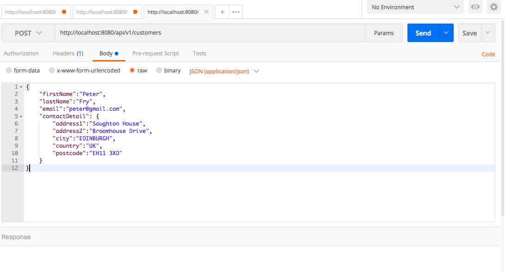
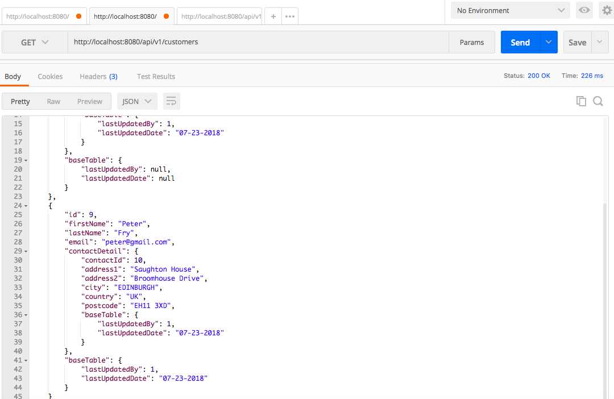
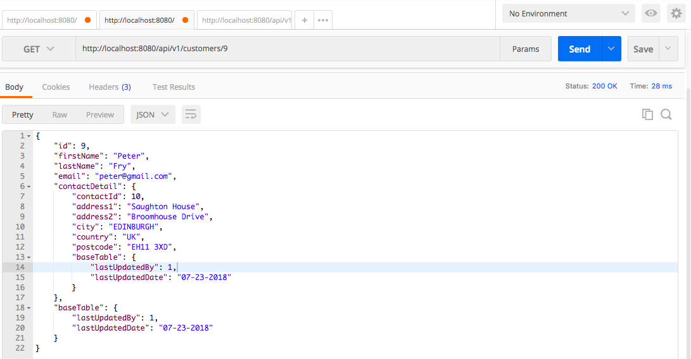

# Spring boot application with AngularJS

## Prerequisite
- Java 8
- Maven 3+
- Spring tool suite
- Sqlite
- Postman

## Sqlite Installation
If you don't have Sqlite in your system, You can install using brew command
```console
$brew install sqlite3
```
You may verify successful Installation using the following command
```console
$sqlite3 -version
```
- Go to the project folder in your terminal, then create the db in sqlite3.
```console
$sqlite3 customer.db
```

- You have to initialise DDL using the following script.
```sql
CREATE TABLE CONTACT
(
  contact_Id BIGINT PRIMARY KEY,
  address1 VARCHAR,
  address2 VARCHAR,
  city VARCHAR,
  country VARCHAR,
  postcode VARCHAR,
  LAST_UPDATED_BY BIGINT,
  LAST_UPDATED_DATE DATE
);

CREATE TABLE CUSTOMER
(
  ID BIGINT PRIMARY KEY,
  first_Name VARCHAR,
  last_Name VARCHAR,
  email VARCHAR,
  contact_Id BIGINT,
  LAST_UPDATED_BY BIGINT,
  LAST_UPDATED_DATE DATE,
  FOREIGN KEY(contact_Id) REFERENCES contact(contact_Id)
);


CREATE TABLE hibernate_sequence
(
  next_val BIGINT
);
INSERT INTO hibernate_sequence(next_val) VALUES(4);
```
- verify the tables using the following command to make sure all tables are created successfully.
```console
sqlite> .tables
CONTACT             CUSTOMER            hibernate_sequence
```

## Testing API using Postman
- Create Customer


- Get all Customer


- Get by ID


## Angular project
Installation
- yarn and nodejs(npm)
```console
brew install yarn
```
This will also install Node.js if it is not already installed.

You can verify post Installation using the following command
```console
$yarn --version
1.7.0
$ npm --version
5.6.0
```

- Angular CLI
```console
$npm install -g @angular/cli
```
Verify the Installation using the following command
```console
$ng -v

     _                      _                 ____ _     ___
    / \   _ __   __ _ _   _| | __ _ _ __     / ___| |   |_ _|
   / △ \ | '_ \ / _` | | | | |/ _` | '__|   | |   | |    | |
  / ___ \| | | | (_| | |_| | | (_| | |      | |___| |___ | |
 /_/   \_\_| |_|\__, |\__,_|_|\__,_|_|       \____|_____|___|
                |___/


Angular CLI: 6.0.8
Node: 8.11.3
OS: darwin x64
Angular:
...

Package                      Version
------------------------------------------------------
@angular-devkit/architect    0.6.8
@angular-devkit/core         0.6.8
@angular-devkit/schematics   0.6.8
@schematics/angular          0.6.8
@schematics/update           0.6.8
rxjs                         6.2.2
typescript                   2.7.2
```

Now We have to configure in Angular CLI where Yarn is main dependency manager using the following command.

```console
$ng set --golbal packageManager=yarn
```

- Creating UI module
we can create UI project under the same directory where we have created customer service.

```console
$ ls
README.md	customer	images		sql
$ ng new customer-ui -routing
```
Once the command executed successfully, you can see customer-ui folder has been created.
```console
$ ls
README.md	customer	customer-ui	images		sql
```

## Deployment
Create Angular as standalone app and proxy to Spring-boot so that the UI and services are having a separation of concern.

To achieve that, create a `proxy.conf.json` under customer-ui folder as follwos
```json
{
  "/server": {
    "target": "http://localhost:8080",
    "secure": false,
    "changeOrigin": true,
    "logLevel": "debug",
    "pathRewrite": {
      "^/server": ""
    }
  }
}
```
This tell ng server that any request that begin with /server, then it should forward to http://localhost:8080
Now we need to configure the `proxy.conf.json` file in 'package.json' as follows.
```json
"scripts": {
  "ng": "ng",
  "start": "ng serve --proxy-config proxy.conf.json",
  "build": "ng build",
  "test": "ng test",
  "lint": "ng lint",
  "e2e": "ng e2e"
}
```
